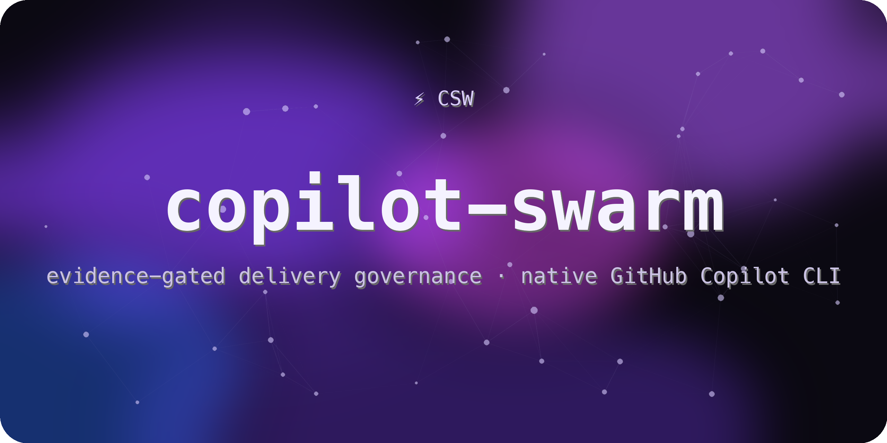

<p align="center"></p>

<h1 align="center">copilot-swarm</h1>
<p align="center">
  <em>GitHub Copilot CLI의 네이티브 task·fleet·작업 관리 위에 구축된 증거 기반 소프트웨어 전달 거버넌스.</em>
</p>
<p align="center">
  <a href="#빠른-시작">빠른 시작</a> ·
  <a href="#기능">기능</a> ·
  <a href="#사용법">사용법</a> ·
  <a href="#동작-원리">동작 원리</a> ·
  <a href="./README.md">English</a>
</p>
<p align="center">
  
  
  
  
</p>

---

> [!NOTE]
> Copilot의 네이티브 `task`와 `/fleet`은 CSW의 실행 기반입니다. CSW의 제품은
> **지속 가능한 증거 기반 완료 계층**으로, goal을 append-only ledger에 바인딩하고 모든 기준이
> 기계 receipt를 충족할 때만 닫습니다. Copilot 스케줄러를 대체하지 않으며 네이티브 확장
> 표면(플러그인 매니페스트·스킬·커스텀 에이전트·훅·네이티브 task/fleet 스케줄링)만으로
> 구현되며 **런타임 의존성 0개**입니다.

## 기능

- **네이티브 우선 위임** — 모델은 호스트 `task` subagent 도구로 작업을 위임합니다.
  사용자는 `/fleet`으로 눈에 보이는 병렬 실행을 시작하고 `/tasks`로 실행 작업을 확인하거나
  취소할 수 있습니다. CSW는 별도 스케줄러를 제공하지 않습니다.
- **지속 가능한 완료 계층** — goal 상태와 append-only `.csw/` ledger가 중단 뒤에도 진실의
  원천으로 남습니다. 워커의 성공 메시지가 아니라 완료 oracle이 작업 종료를 결정합니다.
- **워커 로스터** — 6개 전문 에이전트: `explorer`, `researcher`, `planner`, `gap-analyst`,
  `plan-reviewer`, `verifier`.
- **증거 기반 goal runtime** — 기계 판독 성공 기준(`C0NN | channel: | test: | scenario:`),
  `verify` 또는 `artifact`가 만든 기계 receipt, 모든 기준의 유효 receipt + 미해결 blocker 0일 때만
  통과하는 완료 oracle, steering 가드, `.csw/` 아래 append-only ledger. 자유 형식 증거만으로는
  기준을 pass로 만들 수 없습니다.
- **워크플로우 스킬** — `swarm`, `csw-plan`(explore-우선 + 승인 게이트), `csw-work`(규율 실행),
  `csw-review`(멀티레인 all-or-nothing).
- **전문 스킬** — 디버깅, 요구사항 심층 인터뷰, 프로그래밍, 리팩터링, AI 코드 정리,
  프론트엔드 설계, 시각 QA, Git 작업, 계층형 `AGENTS.md` 초기화, 네이티브 LSP 설정.
- **계층형 스킬 깊이** — 15개 스킬 모두 간결한 진입 본문과 필요할 때만 읽는 의사결정표,
  언어·런타임 플레이북, 실패 복구, QA 매트릭스, 템플릿, 리뷰 체크리스트를 연결합니다.
  `npm run audit:skills`로 패키지별 분량과 참조 도달성을 재현 가능하게 확인할 수 있습니다.
- **훅** — 세션 독트린 주입, steering 감사, AI-slop 주석 점검, 유효한 현재 상태에만 동작하는
  정적 도구 실패 복구 안내, 루트 `agentStop` continuation 게이트.
- **HUD** — 활성 goal의 기준 진행/blocker를 보여주는 상태줄.
- **설치 UX** — 배너·테마·status/install/doctor를 갖춘 `csw` CLI.

> [!WARNING]
> **Receipt 신뢰 경계:** receipt는 구조와 일반적인 변경을 검증하지만, 같은 사용자 권한의 악의적
> 편집자에 대해 인증하지는 않습니다. Git workspace 최신성은 tracked 파일과 ignore되지 않은
> untracked 파일만 포함합니다. ignored 입력은 제외되므로 `artifact` receipt로 별도 바인딩해야 하며,
> non-git 검증에는 workspace 최신성 보장이 없습니다.
> `csw-runtime verify`는 sandbox가 아닌 신뢰된 명령 실행기입니다. 승인된 비데몬 명령만 사용하세요.
> timeout/cancel 시 process tree 정리는
> best-effort이며 daemonized 명령은 살아남을 수 있으므로 cleanup receipt가 필수입니다. 워커 출력,
> 가져온 페이지, 이슈 텍스트, prompt injection 내용으로 argv를 만들면 안 됩니다. 호스트 도구 제한과
> 격리된 worktree는 계속 필수입니다.

## 빠른 시작

> [!TIP]
> [GitHub Copilot CLI](https://docs.github.com/copilot/how-tos/copilot-cli)와 Node.js >= 20이 필요합니다.

native-first 구현은 GitHub 소스 배포용 `0.1.4`로 버전이 지정되었습니다. npm 레지스트리의
`0.1.1`은 이전 구현입니다. `v0.1.4` 태그가 제공되면 아래 설치 절차를 사용하세요.

CSW는 호스트 권한을 생성하지 않습니다. 조사 작업을 위임하기 전에 설치된 Copilot CLI의
deny/사용 가능 도구 정책으로 변경 도구를 차단하세요. 에이전트 설명문은 보안 경계가 아닙니다.
파일을 쓰는 워커에는 별도 git worktree를 제공하고, 통합 전에 실제 diff를 확인하세요.

### 소스에서 설치 (npm publish 이전)

```sh
git clone --branch v0.1.4 https://github.com/wjgoarxiv/copilot-swarm.git && cd copilot-swarm
npm pack                                    # copilot-swarm-0.1.4.tgz 생성
npm install -g ./copilot-swarm-0.1.4.tgz    # clean copy (`npm i -g .` 는 dev 트리를 심링크하므로 비권장)
csw install --dry-run
csw install
```

## 사용법

`copilot` 세션 안에서:

- **루프 실행** — **`csw`** 라고 입력(단독, 또는 `csw <작업>`)하면 풀 증거 기반 루프(`csw-loop`)가
  시작됩니다: goal 바인딩 → 필요 시 계획 → test-first 실행 → 실제 수동 QA → 리뷰 → 완료 oracle 통과까지.
  (명시적 형태: `/copilot-swarm:csw-loop`)
- **위임** — conductor는 호스트 `task` 도구로 모델 기반 subagent에 작업을 맡깁니다.
  사용자가 볼 수 있는 병렬 실행은 `/fleet`, 확인·취소는 `/tasks`를 사용합니다. 조사 워커에는
  호스트가 강제하는 비변경 도구 정책이, 작성 워커에는 격리된 worktree가 필요합니다.
- **계획** — `/copilot-swarm:csw-plan`: explore 우선 조사 → 진짜 미지수만 인터뷰 →
  decision-complete 계획 1건 작성·검토 → 실행 전 **승인 게이트**에서 멈춤.
- **실행** — `/copilot-swarm:csw-work`: 각 작업을 test-first + 실제 수동 QA로 진행, goal runtime의
  oracle이 통과해야만 완료.
- **리뷰** — `/copilot-swarm:csw-review`: compliance / quality / real-QA / scope 레인을 병렬 실행,
  all-or-nothing 게이트.
- **전문 작업** — `/copilot-swarm:csw-debugging`, `/copilot-swarm:csw-programming`,
  `/copilot-swarm:csw-refactor`, `/copilot-swarm:csw-visual-qa` 등을 직접 호출.
- **워커 지정** — `@copilot-swarm:explorer` 처럼 특정 에이전트에 위임.

HUD 상태줄 켜기:

```sh
csw hud      # ~/.copilot/settings.json 에 추가할 스니펫 출력
```

## 동작 원리

| 기능 | Copilot CLI 표면 |
|---|---|
| 모델 기반 위임 | 네이티브 `task` subagent |
| 사용자 표시 병렬 실행 | `/fleet`; 확인·취소는 `/tasks` |
| 워커 로스터 | `agents/*.agent.md` (`copilot-swarm:*` 네임스페이스) |
| 항상-적용 독트린 | `sessionStart` 훅의 `additionalContext` 주입 |
| goal 상태 / oracle | 자체 관리 `.csw/` (JSON 상태 + JSONL ledger) |
| continuation | 루트 `agentStop` 훅만 사용; 오래되거나 잘못된 상태는 fail-open |
| steering / 주석 / 실패 복구 | `userPromptSubmitted` / `postToolUse` / `postToolUseFailure` 훅 |
| HUD | Copilot `statusLine` |

port / keep-native / skip 결정은 [`docs/supporting-components.md`](docs/supporting-components.md)
참고 (예: LSP는 네이티브 유지).

continuation 훅은 subagent 종료를 통제하지 않습니다. 또한 상태가 없거나, 손상되었거나, 기준이
비어 있거나, 완료되었거나, 오래되었거나(기본 7일), safe mode가 켜져 있으면 block을 출력하지
않습니다. 이 fail-open 동작은 손상된 ledger가 호스트를 가두지 않게 하기 위한 것이며, goal 완료의
증거는 아닙니다.

## 개발

```sh
npm test            # 단위 + e2e 테스트
npm run scan        # 금지어 cleanliness 스캔 (전 표면)
npm run release:check
npm run pack:dry-run
python3 generate_cover.py   # 커버 이미지 재생성
```

## 라이선스

MIT — [LICENSE](LICENSE). 텔레메트리·콜홈 없음.
